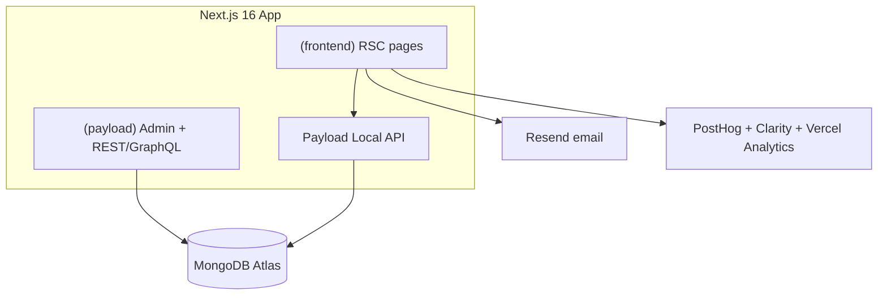

# Zeftrosoft Complete Implementation Plan

Source: [Software Consultancy Website.pdf](./Software%20Consultancy%20Website.pdf) + [DESIGN.md](../DESIGN.md) + current template at `src/`.

**Goal:** Premium consultancy marketing site that generates qualified leads and proves technical credibility — one Next.js + Payload 3 app on MongoDB Atlas.

**Design authority:** [DESIGN.md](../DESIGN.md) (Supabaze-inspired: white/near-black + emerald `#3ecf8e`). Not Nike system.

**Test runner decision:** Vitest + Playwright only (skip Jest).

---

## Architecture (locked)

- RSC by default; `"use client"` only for forms, motion, theme, interactive nav.
- Reuse existing pattern: Pages `hero` + `layout` blocks → `RenderHero` + `RenderBlocks` in `src/app/(frontend)/[slug]/page.tsx`.
- Dedicated collections for entities that need listing/detail/filter; static marketing routes stay as `pages` documents where possible.

---

## Information architecture

| URL | Source | Notes |
|-----|--------|--------|
| `/` | `pages` slug `home` | Custom homepage blocks |
| `/services`, `/services/[slug]` | Collection `services` + index page | Listing + detail |
| `/solutions`, `/solutions/[slug]` | Same `services` collection | Filter `type: service \| solution` |
| `/case-studies`, `/case-studies/[slug]` | Collection `case-studies` | Primary credibility surface |
| `/work` | `pages` or filtered case-studies | Portfolio index; links into case studies |
| `/technologies` | `pages` + tech stack block | Logos + short blurbs |
| `/products` | `pages` + blocks first | Product/capability showcases |
| `/insights`, `/insights/[slug]` | Rebrand `posts` routes from `/posts` | Keep Posts collection; change URLs + nav |
| `/about`, `/process` | `pages` | Block-composed |
| `/team`, `/team/[slug]` optional | Collection `team` | Grid + optional bio |
| `/careers`, `/careers/[slug]` | Collection `careers` | Jobs listing + detail |
| `/contact` | Existing form-builder page | Enhance + Resend |
| `/privacy`, `/terms` | `pages` | Legal |
| `/sitemap.xml` | Existing next-sitemap + collection sitemaps | Extend |

**Default schema choice (to avoid over-collection):**
- Collections: `services` (includes solutions via `type`), `case-studies`, `team`, `careers`, keep `posts` / `pages` / `media` / `categories` / `users`
- Products + technologies: start as **page blocks + Media**; promote to collections only if CMS needs many entries with filters

---

## CMS model sketch

### New collections

**`services`** — title, slug, type (`service`|`solution`), summary, icon/media, body (Lexical), outcomes[], relatedCaseStudies → `case-studies`, SEO meta, drafts

**`case-studies`** — title, slug, client, industry, services[], challenge, solution, results[] (metric + label), stack[], gallery → media, testimonial (quote, name, role), featured bool, SEO, drafts

**`team`** — name, slug, role, photo, bio, linkedIn, order

**`careers`** — title, slug, location, type (full-time/contract), description, applyUrl or form relation, publishedAt, drafts

### New / extended page blocks (add to Pages `layout` + `RenderBlocks`)

| Block | Purpose |
|-------|---------|
| `logoCloud` | Client / tech logos |
| `statsRow` | Measurable outcomes |
| `servicesGrid` | Featured services from collection or manual |
| `caseStudyShowcase` | Featured case studies |
| `testimonials` | Quotes |
| `techStack` | Stack icons + labels |
| `processSteps` | Numbered process |
| `teamGrid` | Team members |
| `faq` | Accordion |
| `leadCapture` | Compact CTA + form relation |

Keep existing: `cta`, `content`, `mediaBlock`, `archive`, `formBlock`.

### Globals

- Expand **Header**: logo, primary CTA (“Talk to us”), nested nav (optional later)
- Expand **Footer**: multi-column link groups, social, legal links, company blurb
- Optional **SiteSettings** global: company name, contact email, social URLs, default OG image

---

## Phase-by-phase plan

### Phase 0 — Foundation

**Done when:** App runs as Zeftrosoft-branded shell; template demo content is replaceable; env documented.

- Confirm Mongo (`DATABASE_URL`), `PAYLOAD_SECRET`, `NEXT_PUBLIC_SERVER_URL` in `.env` / `.env.example`
- Rebrand SEO title template in `src/plugins/index.ts` from “Payload Website Template” → Zeftrosoft
- Update Logo / site name in Header/Footer components
- Trim or replace seed (`src/endpoints/seed/`) so demo posts do not ship to production
- Keep pnpm scripts; no Jest

### Phase 1 — Design system

**Detailed plan:** [PHASE_1_DESIGN_SYSTEM.md](./PHASE_1_DESIGN_SYSTEM.md)

**Done when:** Global CSS tokens match DESIGN.md; primary CTA is emerald; chrome is near-monochrome.

- Map DESIGN.md tokens to CSS variables in frontend globals (canvas `#ffffff`, ink `#171717`, primary `#3ecf8e`, hairlines, spacing)
- Restyle shadcn Button / Input / Card toward `button-primary-green`, outline secondary, `rounded.sm` (6px) — not full pills
- Typography: keep Geist (DESIGN-approved Circular substitute); add display utility classes
- Section spacing 64–96px; ~1280px content width
- Motion deferred to Phase 3; Phase 1 only `prefers-reduced-motion` base
- Light canvas default; Header/Footer/Logo restyle; no new CMS models
### Phase 2 — Payload models

**Done when:** New collections registered, types generated, admin usable, revalidation hooks wired.

- Add collections under `src/collections/` and register in `src/payload.config.ts`
- Add new blocks under `src/blocks/`; wire `RenderBlocks.tsx` + Pages `layout`
- SEO plugin fields on new collections; `generate:types` + `generate:importmap`
- Access: public read for published; authenticated write
- afterChange revalidate paths (mirror Pages/Posts pattern)

### Phase 3 — Homepage

**Done when:** `/` is a lead-gen + credibility composition, CMS-editable via blocks.

First viewport (one composition): brand + one headline + one supporting line + one CTA group + one dominant visual.

Below fold (one job per section):
1. Logo cloud / trust
2. Services grid
3. Featured case study / outcomes stats
4. Tech stack
5. Insights teaser
6. Final CTA / lead capture

### Phase 4 — Services and solutions

**Done when:** `/services` listing + `/services/[slug]` detail; solutions reachable (filter or `/solutions` alias).

- App routes under `src/app/(frontend)/services/`
- Listing uses Local API; detail with related case studies
- Optional `/solutions` that filters `type === 'solution'`

### Phase 5 — Case studies, work, technologies, products

**Done when:** Case study listing/detail live; work/technologies/products pages exist.

- `/case-studies` + `/case-studies/[slug]` with metrics, stack, gallery, testimonial
- `/work` page: curated grid
- `/technologies` and `/products`: page + blocks first

### Phase 6 — Insights

**Done when:** Blog lives at `/insights`; search/sitemap/nav updated.

- Move frontend routes from `/posts` → `/insights` (redirects for old URLs)
- Categories + archive blocks; keep Lexical Banner/Code blocks
- Extend search plugin index if needed

### Phase 7 — Company pages

**Done when:** About, process, team, careers, privacy, terms are live and editable.

- `/about`, `/process`: Pages + blocks
- `/team`: collection grid (+ optional detail)
- `/careers` + `/careers/[slug]`: jobs collection
- `/privacy`, `/terms`: rich text pages

### Phase 8 — Leads

**Done when:** Contact converts; emails send; analytics see funnel events.

- Keep form-builder + `formBlock` on `/contact`
- Add **Resend** for notification + optional auto-reply
- Sitewide CTA → `/contact`
- Analytics: Vercel Analytics, PostHog, Microsoft Clarity (env-gated)
- Spam: honeypot / rate-limit on submissions

### Phase 9 — SEO

**Done when:** Every public route has unique title/description/OG; sitemaps cover all collections; JSON-LD present.

- Fix `generateTitle` / `generateURL` branding
- Organization + WebSite JSON-LD; Article/Service/CaseStudy where relevant
- Expand sitemaps beyond pages/posts
- robots.txt, canonical URLs, Open Graph defaults

### Phase 10 — Accessibility

**Done when:** WCAG 2.2 AA checklist addressed on primary journeys.

- Semantic landmarks, heading order, skip link
- Keyboard nav + visible focus
- Contrast, form labels/errors, alt text
- `prefers-reduced-motion` for animations

### Phase 11 — Performance

**Done when:** LCP ≤ 2.5s, INP ≤ 200ms, CLS ≤ 0.1.

- `next/image` + Sharp; priority only on LCP hero
- Avoid layout shift; minimize client JS
- Measure with Lighthouse / CrUX; fix regressions before launch

### Phase 12 — Testing

**Done when:** Critical paths covered in CI-friendly tests.

- Vitest: utilities and helpers
- Playwright e2e: home, service detail, case study, contact submit
- `pnpm lint`, `tsc`, `pnpm build` green

### Phase 13 — Production

**Done when:** Definition of Done met; no fake content.

- Vercel + Mongo Atlas prod
- Secrets: Payload, Resend, analytics, cron/preview
- Replace all seed/demo content with real Zeftrosoft content
- Security controls + DoD checklist sign-off

---

## Definition of Done (launch gate)

- [ ] All sitemap routes resolve with real content
- [ ] CMS can edit homepage, services, case studies, insights, company pages, contact
- [ ] Contact submission stores + notifies via Resend
- [ ] TypeScript, ESLint, build, Vitest, Playwright pass
- [ ] SEO meta + sitemap + JSON-LD complete
- [ ] WCAG 2.2 AA issues on primary flows addressed
- [ ] CWV targets measured and within budget or with documented remediations
- [ ] Analytics live in production
- [ ] No lorem ipsum / template Payload demo content

---

## Suggested delivery slices

1. Phases 0–2 (foundation + design + models)
2. Phase 3 (homepage)
3. Phases 4–5 (services + case studies)
4. Phases 6–7 (insights + company)
5. Phase 8 (leads)
6. Phases 9–13 (SEO → launch)

---

## Out of scope for v1

- Customer portal / authenticated client dashboards
- Multilingual (unless added later via Payload localization)
- Payment on forms
- GSAP-heavy animation systems
- Separate microservices or headless frontend outside this Next app
