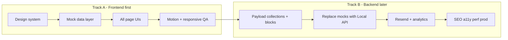

# Zeftrosoft — UI-First Revised Plan

**Why this revise:** First lock **complete UI/UX across all PRD pages** with typed mock data. Payload collections, blocks, and Local API come **after** pages look and feel right. Avoids redesigning CMS schemas when the UI changes.

**Sources:** [Software Consultancy Website.pdf](./Software%20Consultancy%20Website.pdf) · [DESIGN.md](../DESIGN.md) · current app at `src/`  
**Design authority:** [DESIGN.md](../DESIGN.md) (white/ink + emerald `#3ecf8e`) — not Nike  
**Status:** Current implementation authority (supersedes CMS-first phase order in [IMPLEMENTATION_PLAN.md](./IMPLEMENTATION_PLAN.md))

---

## Strategy split

| Track | Focus | Payload / Mongo |
|-------|--------|-----------------|
| **A — UI** | Routes, layouts, sections, interaction, mock content | Leave template CMS alone; do not add new collections yet |
| **B — Backend** | Collections, blocks, globals, hooks, forms email | Wire UI props to Local API; delete mocks |

---

## Page inventory (all must exist in Track A)

| Route | UI goal with mock data |
|-------|-------------------------|
| `/` | Lead-gen homepage: hero + trust + services + case proof + stack + insights teaser + final CTA |
| `/services`, `/services/[slug]` | Listing + detail (outcomes, related cases) |
| `/solutions`, `/solutions/[slug]` | Same card/detail UI; filter mock `type === 'solution'` |
| `/case-studies`, `/case-studies/[slug]` | Metrics, stack, gallery, testimonial |
| `/work` | Curated portfolio grid → case studies |
| `/technologies` | Logo/blurb grid |
| `/products` | Capability showcases |
| `/insights`, `/insights/[slug]` | Blog listing + article (can restyle `/posts` paths or add `/insights` aliases with mocks) |
| `/about`, `/process` | Story + numbered process |
| `/team`, `/team/[slug]` | Grid + optional bio |
| `/careers`, `/careers/[slug]` | Jobs list + detail |
| `/contact` | Form UI (submit can no-op or console until Track B) |
| `/privacy`, `/terms` | Legal long-form |

Shell: Header (nav + emerald “Talk to us”) + Footer (multi-column, social, legal) on every page.

---

## Track A — Frontend (do this first)

### A0 — Foundation (keep / finish)

- Phase 1 tokens already in [`src/app/(frontend)/globals.css`](../src/app/(frontend)/globals.css) / UI primitives
- Confirm light canvas, emerald primary CTA, ~1280px container, Geist typography
- No new CMS work in A0–A8

### A1 — Mock data + section kit

**Mock layer** — `src/mock/` (typed TS, shapes match future CMS so Track B is a swap):

- `site.ts` — nav, CTA, footer columns, company blurb
- `services.ts` — services + solutions
- `caseStudies.ts` — featured + detail payloads
- `team.ts`, `careers.ts`, `insights.ts`, `technologies.ts`, `products.ts`
- `home.ts` — homepage section composition referencing the above

**Section components** — `src/components/sections/` (pure React; later become Payload block Components):

`LogoCloud`, `StatsRow`, `ServicesGrid`, `CaseStudyShowcase`, `Testimonials`, `TechStack`, `ProcessSteps`, `TeamGrid`, `Faq`, `LeadCapture`, `PageHero`, `ContentSplit`

Reuse Phase 1 button/input/card tokens. Prefer **no cards in heroes**; cards only where interaction/listing needs them (per design rules + DESIGN.md).

### A2 — Chrome

- Restyle Header/Footer against mock `site.ts` (hardcode in components or read mocks — **not** Payload globals yet)
- Primary nav covers full sitemap; one green CTA → `/contact`

### A3 — Homepage UI

One first-viewport composition: brand + headline + one line + CTA group + one dominant visual.  
Below fold (one job per section): logo cloud → services → case/outcomes → tech → insights teaser → lead CTA.  
Add 2–3 intentional motions (`motion` ok here).

### A4 — Offer pages

- `/services` + `/services/[slug]` from mocks  
- `/solutions` + `/solutions/[slug]` (filter)  
- Shared service detail layout component

### A5 — Proof pages

- `/case-studies` + `[slug]`, `/work`  
- Metrics row, stack chips, gallery, testimonial block

### A6 — Capabilities

- `/technologies`, `/products` — block-style sections, mock media/placeholders

### A7 — Insights UI

- Listing + detail at `/insights` (redirect or parallel to existing `/posts` as needed)
- Mock posts; ignore search plugin until Track B

### A8 — Company + legal + contact

- `/about`, `/process`, `/team`, `/team/[slug]`, `/careers`, `/careers/[slug]`
- `/contact` form UI (client validation; submit stub)
- `/privacy`, `/terms`

### A9 — UI QA gate

**Track A done when:**

- Every sitemap URL renders on desktop + mobile without CMS dependency
- Design tokens consistent; no lorem-looking chrome (realistic mock copy OK)
- Keyboard-usable nav + visible focus on primary flows
- Ready for stakeholder UI review before any new Payload schemas

---

## Track B — Backend (only after Track A gate)

### B1 — Payload models

Collections: `services`, `case-studies`, `team`, `careers` (field shapes = mock types).  
Blocks: register section kit as Pages `layout` blocks + `RenderBlocks`.  
Globals: Header, Footer, SiteSettings matching chrome mocks.  
Access, drafts, SEO fields, revalidate hooks.

### B2 — Wire frontend

- Replace `src/mock/*` imports with Payload Local API in RSC pages
- Keep section components; pass CMS data as props
- Seed real Zeftrosoft content; delete mocks when unused

### B3 — Leads + analytics

- Form builder + Resend; honeypot/rate-limit  
- PostHog / Clarity / Vercel Analytics (env-gated)

### B4 — Launch hardening

- SEO (meta, sitemap, JSON-LD), a11y WCAG 2.2 AA, CWV, Vitest + Playwright, Vercel + Atlas prod  
- Definition of Done from PRD

---

## Locked decisions

| Decision | Choice |
|----------|--------|
| Order | **All UI pages + mocks first**; Payload models second |
| Data in Track A | Typed TS mocks in `src/mock/`, not Mongo |
| Components | Build sections as React first; promote to Payload blocks in B1 |
| Existing Payload template | Keep running for admin/dev; do not expand collections until B1 |
| Insights URL | Prefer `/insights` in UI track; map Posts collection in B2 |
| Contact submit | Stub until B3 |

---

## Suggested delivery slices

1. **A1–A2** — mock layer + Header/Footer  
2. **A3** — homepage  
3. **A4–A5** — services/solutions + case studies/work  
4. **A6–A8** — remaining pages  
5. **A9** — UI review gate  
6. **B1–B2** — CMS + wire  
7. **B3–B4** — leads → launch  

---

## Immediate next implementation

Start **A1 + A2**: `src/mock/` types + sample data, section folder scaffold, Header/Footer driven by mocks, then **A3 homepage**.

---

## Track A checklist

- [x] A1: `src/mock/` + `src/components/sections/`
- [x] A2: Header/Footer from mocks
- [ ] A3: Homepage
- [ ] A4: Services + Solutions
- [ ] A5: Case studies + Work
- [ ] A6: Technologies + Products
- [ ] A7: Insights
- [ ] A8: Company + contact + legal
- [ ] A9: UI QA gate
- [ ] Track B: Payload → wire → leads → launch
